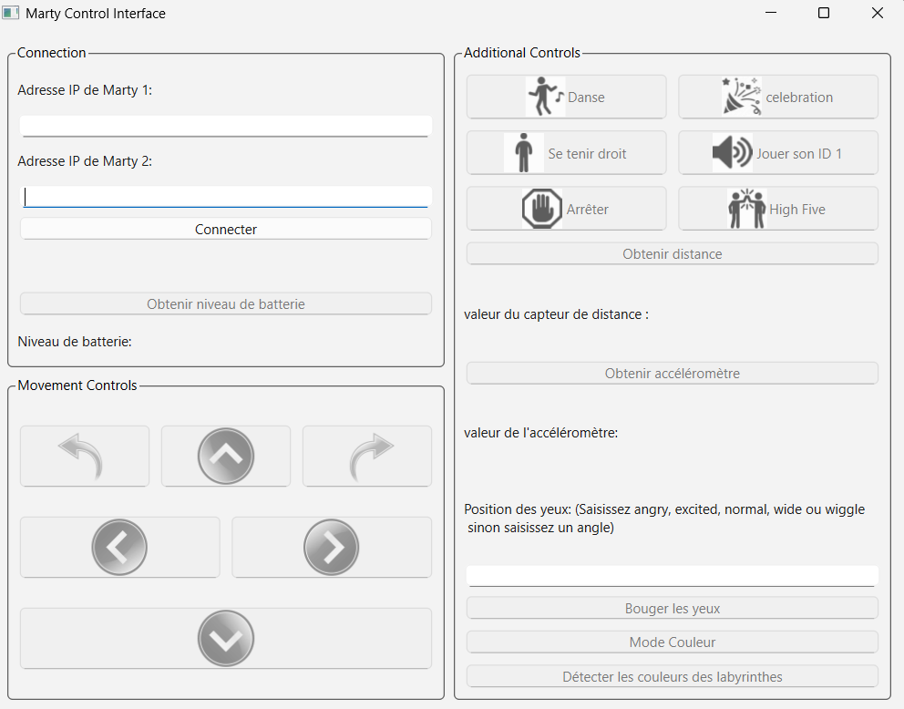

# 🤖 Projet Marty


Bienvenue dans le projet **Marty** ! Ce projet vise à développer une application en **Python** avec **PyQt6** pour piloter et gérer des robots Marty. Ce fichier README présente les objectifs, les fonctionnalités, la structure du projet et les instructions pour bien démarrer.

---

## 📌 Contexte

- **Gestion de projet** : Utilisation d’un outil de gestion de projet couplé à Git.
- **Versioning** : Suivi des versions du code avec Git.
- **Technologies utilisées** : Python & PyQt6.
- **Accès enseignants :** :
  - Quentin.Chassel@u-bourgogne.fr  
  - Hermine.Chatoux@u-bourgogne.fr  
  - Duncan.Luguern@u-bourgogne.fr  
  - Meldrick.Reimmer@u-bourgogne.fr
    
---

## 🧠 Fonctionnalités

### 🔹 Partie 1 : Contrôle de base

- **Connexion/Déconnexion** des robots Marty via le protocole de communication.
- **Interface graphique** :
  - Pilotage : avancer, reculer, tourner
  - Émotions : regard, danse, célébration
  - Capteurs : distance, obstacle, batterie, flux vidéo, capteur couleur
  - Contrôle : boutons de l’interface + touches clavier
- **Pilotage avancé** :
  - Manette de jeu ou périphériques externes (vibration, lumière)
  - Création d’une **liste d’instructions** à exécuter séquentiellement

### 🔹 Partie 2 : Scénario collaboratif

- **Gestion de deux robots** : Marty1 démarre toujours en premier
- **Labyrinthe** :
  - Déplacement tour par tour
  - Lecture de QR codes au sol pour reconstituer une phrase mystère
  - Rencontre au centre avec célébration
  - **Chorégraphie synchronisée** des deux robots

---

## 🗂️ Structure du projet

```plaintext
marty_project/
├── Application/
│   ├── Interface/
│   │   ├── Images/
│   │   │   ├── celebrate.png
│   │   │   ├── dance.png
│   │   │   ├── down_blue_arrow.png
│   │   │   ├── high_five.png
│   │   │   ├── L.png
│   │   │   ├── left_blue_arrow.png
│   │   │   ├── R.png
│   │   │   ├── right_blue_arrow.png
│   │   │   ├── rotation_left_arrow.png
│   │   │   ├── rotation_right_arrow.png
│   │   │   ├── sound.png
│   │   │   ├── stand.png
│   │   │   ├── stop.png
│   │   │   ├── up_blue_arrow.png
│   │   └── ...
│   ├── main.py
│   ├── Class_MartyControlApp.py
│   ├── Class_MartyRobot.py
│   └── ...
├── communication/
│   ├── marty.py
│   └── ...
└── README.md
```
---

## 🖼️ Aperçu de l’interface de contrôle

Voici une capture d’écran de l’interface graphique utilisée pour piloter les robots Marty :




